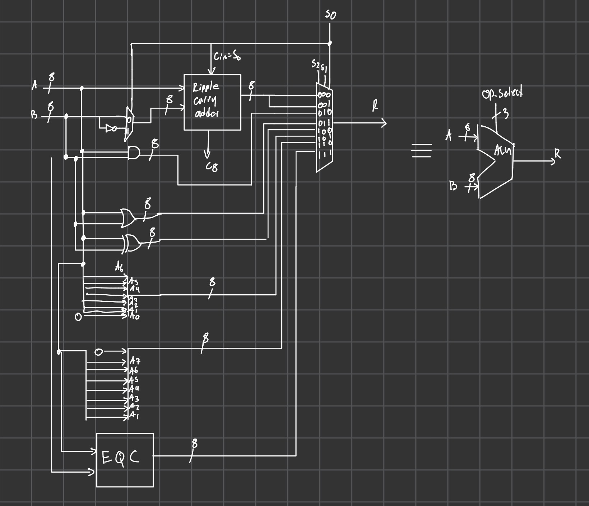
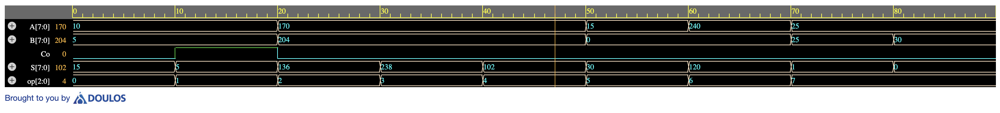
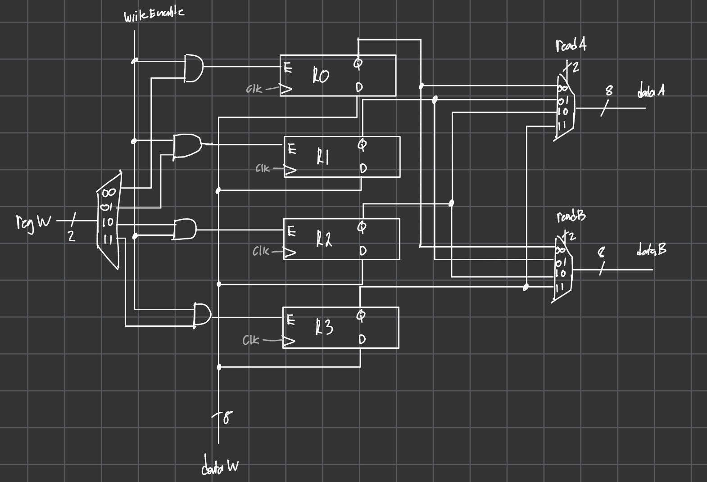
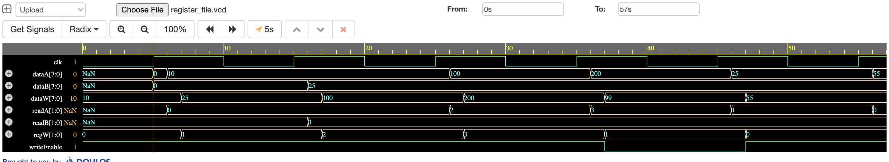
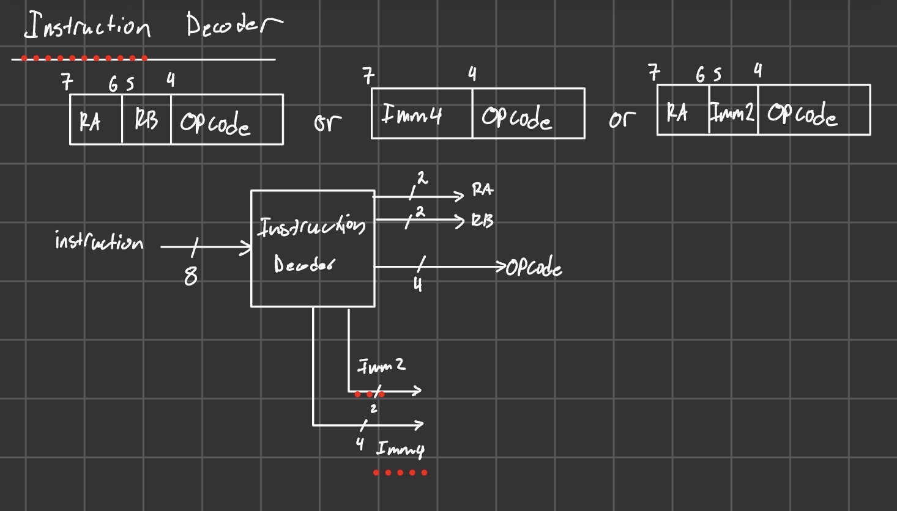
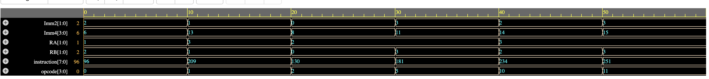
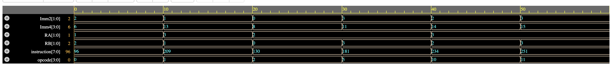
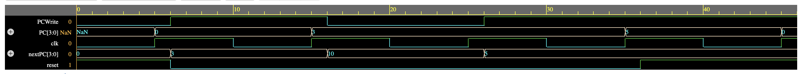

# Verilog 8-bit CPU

This project is an 8-bit CPU built from scratch in Verilog.

## Current Status

### Completed

* 8-bit ALU
* Full adder
* Ripple-carry adder
* Bitwise AND, OR, XOR
* Logical shift left and shift right
* Equality comparison
* ALU testbench using Icarus Verilog
* 8-bit Register
* Register File
* Register file testbench using Icarus Verilog
* Instruction decoder
* Instruction decoder testbench using Icarus Verilog
* Initial instruction set architecture
* Instruction memory
* Instruction memory testbench using Icarus Verilog
* Program counter
* Program counter testbench using Icarus Verilog
* Data memory
* Data memory testbench using Icarus Verilog

### In Progress

* Control unit
* CPU top module

---

# ALU Design

The ALU takes two 8-bit inputs, `A` and `B`, and a 3-bit operation select signal, `op[2:0]`.

The ALU will eventually be controlled by internal `ALUop` signals generated by the control unit. This allows the CPU instruction opcode to be separate from the ALU operation select signal.



## ALU Operations

| op    | Operation        |
| ----- | ---------------- |
| `000` | ADD              |
| `001` | SUB              |
| `010` | AND              |
| `011` | OR               |
| `100` | XOR              |
| `101` | Shift Left       |
| `110` | Shift Right      |
| `111` | Equal Comparison |

## Running the ALU Testbench

```bash
iverilog -s alu_8bit_tb -o alu_test src/alu/alu_8bit.v tb/alu/alu_8bit_tb.v
vvp alu_test
```

## ALU Simulation

The ALU was tested using an Icarus Verilog testbench. The testbench checks ADD, SUB, AND, OR, XOR, shift left, shift right, and equality comparison.



---

# Register File Design

The register file stores values used by the CPU datapath. It contains four 8-bit registers: `R0`, `R1`, `R2`, and `R3`.

The register file has one write port and two read ports. This allows the CPU to write one value into a selected register while also reading two register values for ALU operations.



### Register File Signals

| Signal        | Width | Direction | Description                                   |
| ------------- | ----: | --------- | --------------------------------------------- |
| `clk`         | 1-bit | Input     | Clock signal                                  |
| `writeEnable` | 1-bit | Input     | Enables writing to a register                 |
| `regW`        | 2-bit | Input     | Selects which register to write to            |
| `dataW`       | 8-bit | Input     | Data value written into the selected register |
| `readA`       | 2-bit | Input     | Selects the register output for `dataA`       |
| `readB`       | 2-bit | Input     | Selects the register output for `dataB`       |
| `dataA`       | 8-bit | Output    | First read data output                        |
| `dataB`       | 8-bit | Output    | Second read data output                       |

### Register Address Mapping

| Address | Register |
| ------- | -------- |
| `00`    | `R0`     |
| `01`    | `R1`     |
| `10`    | `R2`     |
| `11`    | `R3`     |

### Write Behavior

The register file writes data on the rising edge of `clk` when `writeEnable` is high.

The write address `regW` is decoded into four enable signals:

```text
en0 = writeEnable & (regW == 00)
en1 = writeEnable & (regW == 01)
en2 = writeEnable & (regW == 10)
en3 = writeEnable & (regW == 11)
```

## Running the Register File Testbench

```bash
iverilog -s register_file_tb -o rf_test src/registers/register_8bit.v src/registers/register_file.v tb/registers/register_file_tb.v
vvp rf_test
```

## Register File Simulation

The register file was tested using an Icarus Verilog testbench. The testbench checks that values can be written to each register, read through both read ports, and protected from accidental writes when `writeEnable` is disabled.



---

# Instruction Set Architecture

See [`docs/ISA.md`](docs/ISA.md) for the current ISA, instruction formats, opcode map, and example encodings.

## Decoder Fields

| Field    | Bits    | Description                                       |
| -------- | ------- | ------------------------------------------------- |
| `RA`     | `[7:6]` | Register A / destination register                 |
| `RB`     | `[5:4]` | Register B or Imm2                                |
| `Imm2`   | `[5:4]` | 2-bit immediate used for shifts                   |
| `Imm4`   | `[7:4]` | 4-bit immediate used for Imm4-format instructions |
| `opcode` | `[3:0]` | 4-bit instruction opcode                          |

## Instruction Decoder Block Diagram



## Running the Instruction Decoder Testbench

```bash
iverilog -s instruction_decoder_tb -o decoder_test src/control_unit/instruction_decoder.v tb/control_unit/instruction_decoder_tb.v
vvp decoder_test
```

## Instruction Decoder Simulation

The instruction decoder was tested using an Icarus Verilog testbench. The testbench checks that encoded 8-bit instructions are correctly separated into register fields, immediate fields, and opcode fields.



---

# Instruction Memory Design

The instruction memory stores the program instructions that the CPU will execute. It takes a 4-bit address as input and outputs the 8-bit instruction stored at that address.

In the full CPU, the program counter will provide the address to instruction memory. The instruction memory will then output the instruction to the instruction decoder.

Conceptually:

```text
Program Counter → Instruction Memory → Instruction Decoder
```

## Instruction Memory Signals

| Signal        | Width | Direction | Description                                |
| ------------- | ----: | --------- | ------------------------------------------ |
| `address`     | 4-bit | Input     | Selects one of 16 instruction locations    |
| `instruction` | 8-bit | Output    | Instruction stored at the selected address |

## Memory Organization

The current instruction memory is organized as:

```text
16 instruction locations × 8 bits
```

Because the address input is 4 bits wide, the instruction memory can address 16 instruction locations.

## Current Hardcoded Program

The current instruction memory is hardcoded with a small test program.

| Address | Instruction   | Binary     | Meaning                                          |
| ------- | ------------- | ---------- | ------------------------------------------------ |
| `0000`  | `LI R1, 3`    | `00111010` | Load the value `3` into `R1`                     |
| `0001`  | `ADD R1, R2`  | `01100000` | `R1 = R1 + R2`                                   |
| `0010`  | `ST R1, [R0]` | `01001110` | Store `R1` into memory at address stored in `R0` |
| `0011`  | `NOP`         | `00001111` | Do nothing                                       |

All other addresses currently output `NOP` by default.

## Hardcoded ROM Design

The instruction memory is currently implemented as a hardcoded ROM using a `case` statement. This makes the first version simple and easy to debug because the program is directly visible in the Verilog source file.

Although the program is hardcoded for now, this is not the final plan. Later, the instruction memory will be changed so that programs can be loaded from an external program file instead of manually editing the Verilog module.

A future version may use a `.mem` file so different programs can be tested more easily.

## Running the Instruction Memory Testbench

```bash
iverilog -s instruction_memory_tb -o imem_test src/memory/instruction_memory.v tb/memory/instruction_memory_tb.v
vvp imem_test
```

## Instruction Memory Simulation

The instruction memory was tested using an Icarus Verilog testbench. The testbench checks that each programmed address returns the expected 8-bit instruction and that unprogrammed addresses return `NOP`.



---

# Program Counter Design

The program counter stores the address of the current instruction. It provides the address used by instruction memory to fetch the next instruction.

In the full CPU, the next PC value will be calculated externally by the datapath, usually using the ALU. This allows the CPU to support normal instruction sequencing and future branch behavior.

Conceptually:

```text
Program Counter → Instruction Memory → Instruction Decoder
```

## Program Counter Signals

| Signal    | Width | Direction | Description                           |
| --------- | ----: | --------- | ------------------------------------- |
| `clk`     | 1-bit | Input     | Clock signal                          |
| `reset`   | 1-bit | Input     | Resets the PC to `0000`               |
| `PCWrite` | 1-bit | Input     | Enables the PC to update              |
| `nextPC`  | 4-bit | Input     | Next address value loaded into the PC |
| `PC`      | 4-bit | Output    | Current instruction address           |

## Program Counter Behavior

On the rising edge of `clk`, the program counter behaves as follows:

```text
if reset = 1:
    PC = 0000
else if PCWrite = 1:
    PC = nextPC
else:
    PC holds its current value
```

The PC does not calculate `PC + 1` internally. Instead, `nextPC` is calculated outside the PC module by the datapath/control logic. This keeps the PC simple and allows the same PC module to support normal instruction flow and branches later.

For normal instruction sequencing:

```text
nextPC = PC + 1
PCWrite = 1
```

For branch instructions, the datapath can later calculate:

```text
nextPC = PC + SE(Imm4)
```

## Running the Program Counter Testbench

```bash
iverilog -s program_counter_tb -o pc_test src/control_unit/program_counter.v tb/control_unit/program_counter_tb.v
vvp pc_test
```

## Program Counter Simulation

The program counter was tested using an Icarus Verilog testbench. The testbench checks that reset sets the PC to zero, `PCWrite` allows the PC to load `nextPC`, and the PC holds its value when `PCWrite` is disabled.



# Data Memory Design

The data memory stores values used by the CPU during program execution. It is separate from instruction memory: instruction memory stores the program instructions, while data memory stores values used by `LD` and `ST` instructions.

The data memory has a 4-bit address input, an 8-bit data input, and an 8-bit data output.


### Data Memory Signals

| Signal     | Width | Direction | Description                        |
| ---------- | ----: | --------- | ---------------------------------- |
| `clk`      | 1-bit | Input     | Clock signal                       |
| `MemRead`  | 1-bit | Input     | Enables reading from memory        |
| `MemWrite` | 1-bit | Input     | Enables writing to memory          |
| `address`  | 4-bit | Input     | Selects one of 16 memory locations |
| `dataIn`   | 8-bit | Input     | Value written into memory          |
| `dataOut`  | 8-bit | Output    | Value read from memory             |

### Memory Organization

The data memory is organized as:

```text
16 memory locations × 8 bits
```

The 4-bit address allows access to 16 memory locations.

### Read and Write Behavior

Writing happens on the rising edge of `clk` when `MemWrite` is high.

Reading is combinational. When `MemRead` is high, `dataOut` shows the value stored at the selected address. When `MemRead` is low, `dataOut` outputs zero.

### ISA Connection

The data memory is used by the load and store instructions:

| Instruction   | Meaning        |
| ------------- | -------------- |
| `LD RA, [RB]` | `RA = MEM[RB]` |
| `ST RA, [RB]` | `MEM[RB] = RA` |

Since the register file outputs 8-bit values and data memory uses a 4-bit address, the CPU datapath can use the lower 4 bits of the address register value:

```text
address = RB[3:0]
```

## Running the Data Memory Testbench

```bash
iverilog -s data_memory_tb -o dmem_test src/memory/data_memory.v tb/memory/data_memory_tb.v
vvp dmem_test
```

## Data Memory Simulation

The data memory was tested using an Icarus Verilog testbench. The testbench checks that values can be written to memory, read back correctly, and that `dataOut` outputs zero when `MemRead` is disabled.


---

# Next Steps

Planned next modules:

* Control FSM
* CPU top module
* Full CPU testbench

The next major goal is to connect:

```text
Program counter → instruction memory → instruction decoder → control unit → register file → ALU → writeback
```

Once these blocks are connected, the CPU should be able to execute a small program using the defined 8-bit ISA.
